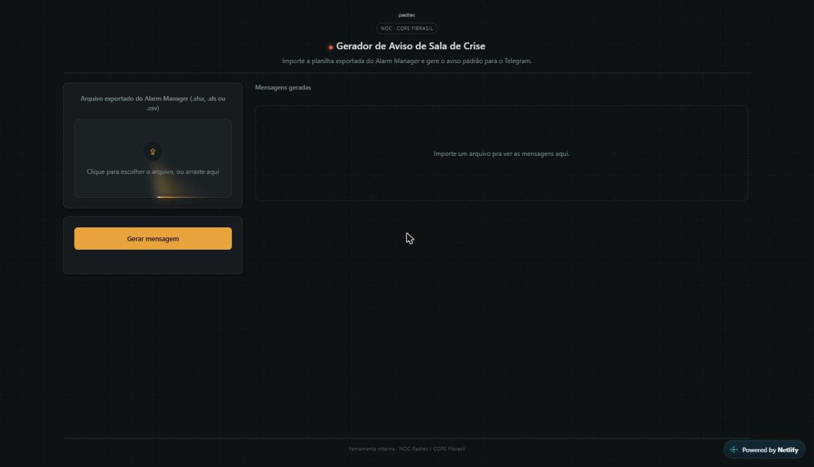

# Gerador de Aviso de Sala de Crise


[](https://gerador-sala-de-crise.netlify.app/)

Ferramenta web que gera automaticamente a mensagem padronizada de abertura de **Sala de Crise** para o Telegram, a partir da planilha exportada de um sistema de gestão de alarmes (Alarm Manager). Criada para a rotina de NOC da Padtec S/A / COPE Fibrasil.

**🔗 Demo ao vivo:** https://gerador-sala-de-crise.netlify.app/



## Contexto

Quando uma ocorrência crítica é identificada, a equipe de NOC precisa abrir uma Sala de Crise e comunicar o grupo responsável rapidamente, com informações consistentes: local afetado, quantidade de clientes impactados, splitters envolvidos e equipamento relacionado. Sob pressão de tempo, montar essa mensagem manualmente é sujeito a erro e a inconsistência de formato entre pessoas diferentes da equipe.

## Problema

- Mensagem de abertura de Sala de Crise montada manualmente, com risco de informação incompleta ou incorreta.
- Cada pessoa da equipe formatava a mensagem de um jeito diferente.
- O número do chamado (TTK) normalmente ainda não existe nesse momento, pois a equipe aciona a Sala de Crise antes da geração automática do chamado — então a mensagem não pode depender dele.

## Solução

Uma página web single-page, sem backend: o usuário importa (ou arrasta) o arquivo `.xlsx`, `.xls` ou `.csv` exportado do sistema de gestão de alarmes, e a ferramenta:

1. Lê a planilha inteiramente no navegador (nada é enviado a um servidor).
2. Agrupa as linhas por local afetado.
3. Aplica a regra de negócio (só gera aviso para afetação ≥ 100 clientes; classifica como `COPE` ou `NOC` conforme o volume).
4. Extrai o intervalo de splitters e o(s) equipamento(s) envolvidos, tratando os diferentes formatos de identificador técnico (Huawei, Nokia/Alcatel físico e lógico).
5. Monta a mensagem final no formato já usado pela equipe, pronta para copiar com um clique e colar no grupo do Telegram.

## Arquitetura

```
Exportação do sistema de gestão de alarmes
        (arquivo .xlsx / .xls / .csv)
                    ↓
      Leitura no navegador (SheetJS)
                    ↓
   Agrupamento por local + regra de volume
   (≥100 → COPE, ≥300 → NOC, <100 → ignora)
                    ↓
  Extração de splitters e equipamento por regex
                    ↓
      Geração da mensagem padronizada
                    ↓
   Cópia com 1 clique → envio manual ao Telegram
```

## Tecnologias

- **HTML5 + CSS3 + JavaScript puro** — sem framework, sem etapa de build.
- **[SheetJS (xlsx.js)](https://github.com/SheetJS/sheetjs)** — leitura de `.xlsx`/`.xls` direto no navegador.
- Parser CSV próprio, com detecção automática de delimitador (`,`, `;` ou tab).
- **Clipboard API** — cópia da mensagem gerada com um clique.
- **Canvas API** — efeito visual de fundo (decorativo).
- **Hospedagem:** [Netlify](https://www.netlify.com/) (deploy estático, contínuo).

Tudo roda 100% client-side: nenhum dado da planilha sai do navegador do usuário.

## Principais funcionalidades

- Importação de planilha por seleção de arquivo ou drag-and-drop.
- Reconhecimento de colunas por alias (aceita `entidade` ou `MOI`, `local`, `splitterPortName`, `ontsByPon`, etc.), tolerante a variações de cabeçalho.
- Extração automática do campo "equipamento" a partir do identificador técnico bruto, com regras específicas por fabricante/formato.
- Classificação automática do tipo de sala (`COPE` a partir de 100 clientes afetados, `NOC` a partir de 300).
- Mensagem final no formato padrão já usado pela equipe, pronta para colar no Telegram.
- Funciona mesmo sem o número do TTK, que normalmente ainda não existe no momento da abertura da sala.

## Desafios técnicos

- O identificador técnico do equipamento vem em formatos diferentes dependendo do fabricante (Huawei, Nokia/Alcatel físico, Nokia/Alcatel lógico/VLAN), exigindo regras de extração específicas para cada padrão.
- Cabeçalhos de planilha inconsistentes entre exportações — resolvido com um mapa de aliases normalizado (sem acento, sem espaço, case-insensitive).
- Parsing de CSV colado do Excel, com delimitador variável e campos entre aspas.

## Privacidade e dados

Esta é uma ferramenta **interna** da operação de NOC. A versão publicada aqui é sanitizada: a tabela real de mapeamento "código de site → cidade/UF" (infraestrutura interna da operadora) foi substituída por exemplos fictícios só para o demo funcionar. Nenhum dado de cliente é enviado a servidor algum — todo o processamento acontece no navegador.

## Resultado

Padroniza a comunicação de abertura de Sala de Crise entre a equipe e reduz o tempo entre a identificação da ocorrência e o aviso ao grupo responsável, eliminando o preenchimento manual sujeito a erro.

## Roadmap / Próximas melhorias

- [ ] Importação via print de tela colado (Ctrl+V), com reconhecimento automático de colunas — pensado, ainda não implementado nesta versão.
- [ ] Testes automatizados para as regras de extração de equipamento.
- [ ] Histórico local das últimas mensagens geradas.

## Como rodar localmente

Não há instalação nem dependências: é uma página estática.

```bash
git clone https://github.com/brunomellodasilva/gerador-aviso-sala-de-crise.git
cd gerador-aviso-sala-de-crise
# abra sala-de-crise.html diretamente no navegador
```

## Estrutura do projeto

```
.
├── sala-de-crise.html   # aplicação completa (HTML + CSS + JS)
├── docs/
│   └── screenshot.png   # screenshot usada neste README
├── LICENSE
└── README.md
```

## Autor

**Bruno Mello** — NOC / Infraestrutura / Automação
[GitHub](https://github.com/brunomellodasilva) · [LinkedIn](https://linkedin.com/in/brunomellodasilva)

## Licença

Distribuído sob a licença MIT. Veja [LICENSE](LICENSE) para mais detalhes.
